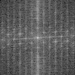
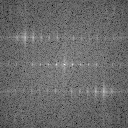
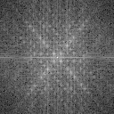

#Tp 1 Traitement de signal
##Remis par Nicolas Hurtubise et Guillaume Riou

###1.4
 Cette représentation fréquentielle est associé à l'image D1r. 

On peut voir que cette image à une forte composante horizontale qui se traduit dans le domaine fréquentiel comme des lignes verticales puisqu'une ligne horizontale contractée dans l'axe ou elle est longue et étendue dans l'axe ou elle est étroite donnera une ligne verticale. 

On déduit aussi la composante verticale des briques par des lignes horizontales dans le domaine fréquentielle mais vu que cette composante verticale est moins forte que la composante horizontale, les lignes horizontales sont moins présentes dans le domaine fréquentiel.

 Cette représentation fréquentielle est associée à l'image D11r puisque cette image se distingue par ses discontinuités verticales entrecoupés par de petites lignes horizontales. On voit dans cette représentation le reflet de l'image avec des direction inversées par le processus expliqué pour la première image.

 Cette représentation fréquentielle est associée à l'image D46r puisque c'est la seule image à avoir de fortes composantes diagonales que l'on voit aussi dans le domaine fréquentiel.

### 3-1

L'image `Monrstein.pgm` est composée des *hautes fréquences* d'un portrait d'Albert Einstein et des *bases fréquences* d'un portrait de Marylin Monroe.

Pour construire cette image, on pourrait faire des opérations similaires à celle réalisée en 2a[1] :

1. Mettre à zéro les basses fréquences de rang `(ε,ε)` de l'image d'Albert Einstein en dessous d'un certain seuil `|ε| <= seuil`
2. Mettre à zéro les hautes fréquences de rang `(ε,ε)` de l'image de Marylin Monroe au-delà d'un certain seuil `|ε| > seuil`
3. Supperposer les deux spectres et faire une transformée de Fourier inverse pour retrouver l'image voulue

On pourrait également se base la distance Euclidienne, comme dans le reste du numéro 2.

On peut noter la présence d'ondulations dans l'image (du *ringing*), ce qui indique que les filtres appliqués créaient effectivement des discontinuités dans le spectre résultant de l'opération.

=======
###3
>>>>>>> 181397811d168cdae404081c45ff4c6e388e7552
